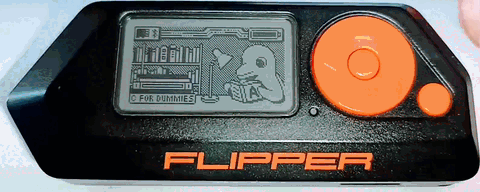

# Je veux utiliser un firmware alternatif

## Pourquoi faire?

* Pour avoir des fonctionalités supplémentaires par rapport au firmware officiel
* Pour personnaliser certains paramètres: selon les firmwares, vous aurez accès à des paramètres de configuration suplémentaires.

*A CONSULTER*: [Un comparatif des firmwares alternatifs](https://github.com/flipperzerofrancophone/awesome-flipperzero-french/blob/main/Firmwares.md)

## De quoi j'ai besoin ?

* Un flipper ;-)
* une carte SD

## Passer à un firmware alternatif

---
**NOTE:**
Cette solution est valable pour les firmwares:
* [RogueMaster](https://github.com/RogueMaster/flipperzero-firmware-wPlugins/releases/)
* [Unleashed](https://github.com/Eng1n33r/flipperzero-firmware/releases)
* Pour les autres, il faudra vérifier

**DANS TOUS LES CAS, nous recommandons de bien lire (en anglais) les préconisations de mainteneurs des firmwares.**

---

1. Il est recommandé de mettre à jour votre FlipperZero
   * Solution simple:
     1. connecter le FlipperZero à votre ordinateur
     2. ouvrir l'url suivante avec chrome (ou chromium) https://my.flipp.dev/
     3. Cliquer sur `Install`
2. Télécharger le firmware de votre choix:
   * [RogueMaster](https://github.com/RogueMaster/flipperzero-firmware-wPlugins/releases/)
   * [Unleashed](https://github.com/Eng1n33r/flipperzero-firmware/releases)
3. Extraire l'archive zip et copier le dossier sur la carte sd externe du Flipper dans le dossier `update` (le créer si vous ne voyez pas)
4. Réinsérer la carte SD dans le Flipper
5. Sur le Flipper, aller dans le browser (Bas, Gauche)
6. Aller dans le dosier `update`, puis dans le dossier que vous venez de copier, chercher et lancer le fichier `update`

